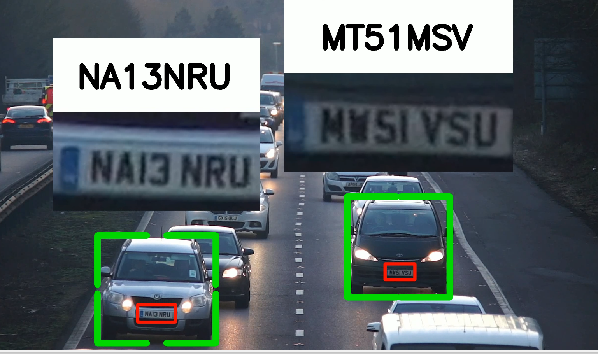

# Automatic Number Plate Recognition (ANPR) using YOLOv8 🚗📸

This project is an end-to-end pipeline that detects vehicles and their license plates in a video, reads the license plate text using OCR, and visualizes the results with bounding boxes and annotated plate text. It utilizes **YOLOv8** for object detection and a tracking mechanism (SORT) to associate detected vehicles across frames.

---

## 🧠 Core Components

### 1. **Object Detection**
- **Model**: `YOLOv8n.pt`
- **Targets**: Cars, motorbikes, buses, and trucks using COCO class IDs.
- **License Plate Detection**: Custom trained YOLO model.

### 2. **Tracking**
- **SORT (Simple Online and Realtime Tracking)** is used to assign persistent IDs to moving vehicles across frames.

### 3. **OCR (License Plate Reading)**
- After detecting and cropping license plates, OCR is applied to extract the plate number.

### 4. **Data Handling**
- Intermediate detection data is stored in `test.csv`.
- Missing data (e.g., missed frames) is interpolated using linear interpolation and stored in `test_data_updated.csv`.

### 5. **Visualization**
- Bounding boxes and plate text are overlaid on the frames.
- Final result video is saved as `output_new.mp4`.

---

## 🖼️ Output Example

